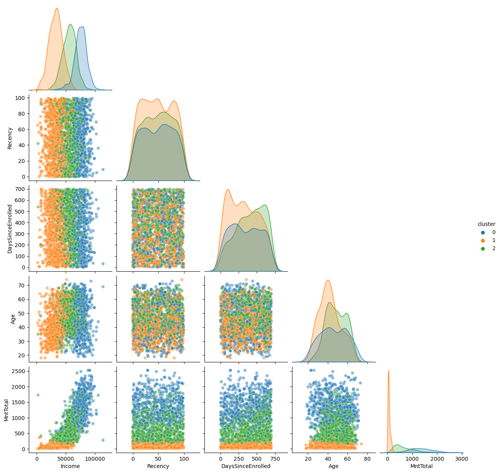
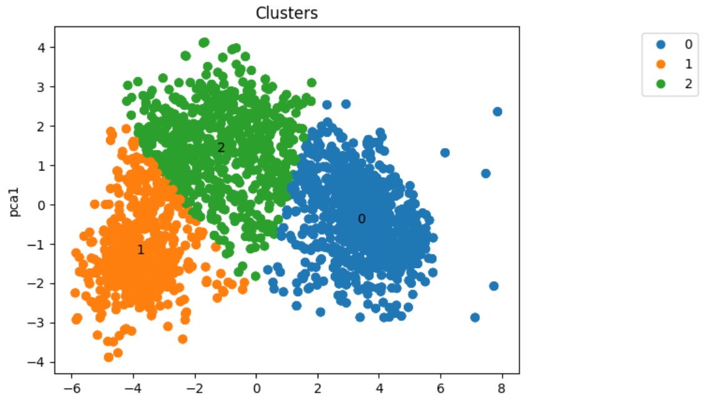
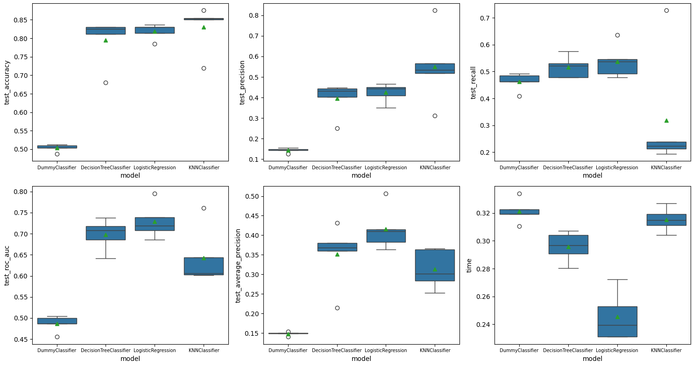

[](https://www.linkedin.com/in/gustavodiasmartins/)
[](https://www.python.org/)

# Case Delivery - Analista de dados

Considere uma empresa bem estabelecida que atua no setor de varejo de alimentos. Atualmente, eles têm cerca de vários milhares de clientes registrados e atendem quase um milhão de consumidores por ano. Eles vendem produtos de 5 grandes categorias: vinhos, carnes, frutas exóticas, peixes especialmente preparados e produtos doces. Estes podem ser divididos ainda mais em produtos de *gold* e regulares. Os clientes podem encomendar e adquirir produtos por meio de 3 canais de vendas: lojas físicas, catálogos e site da empresa. Globalmente, a empresa teve receitas sólidas e uma linha de fundo saudável nos últimos 3 anos, mas as perspectivas de crescimento dos lucros para os próximos 3 anos não são promissoras... Por esse motivo, várias iniciativas estratégicas estão sendo consideradas para inverter essa situação. Um deles é melhorar o desempenho das atividades de marketing, com foco especial em campanhas de marketing.




Descrição completa do case [aqui](Case/README.md).

<p align="center"> 
  <a href="https://www.linkedin.com/in/gustavodiasmartins/" target="_blank"></a> 
</p>

## Objetivos

O objetivo deste projeto é mostrar aos alunos como estruturar um projeto para um processo seletivo que foi aplicado na vida real.

Durante o curso, mostrei a importância de realizar o pré-processamento dos dados, bem como a importância de se realizar a análise exploratória dos dados. Muito foi discutido sobre o que deve ser apresentado para em um documento técnico e o que deve ser apresentado em uma apresentação para um público não técnico.

Objetivos detalhados:

- Construir uma análise exploratória robusta.
- Segmentar os clientes da base de dados fornecida.
- Construir um modelo de classificação para prever se um cliente irá comprar o produto oferecido na campanha.
- Apresentar uma estrutura de projeto de Ciência de Dados, com a utilização de notebooks, scripts, relatórios e repositório no GitHub.
- Apresentar boas práticas de programação em Python, como a utilização de funções e arquivos de script para facilitar o reaproveitamento de código.
- Mostrar boas práticas de uso do SciKit-Learn, como a utilização de pipelines e otimização de hiperparâmetros.

## Estrutura do repositório

```
├── Case
├── Data
├── Images
├── Notebooks
├── Reports
```

- Na pasta `data` estão os dados utilizados no projeto. O arquivo `ml_project1_data.csv` é o dataset utilizado originalmente. Os demais arquivos são os datasets gerados durante o projeto.
- Na pasta `images` estão as imagens utilizadas neste README.
- Na pasta `notebooks` estão os notebooks com o desenvolvimento do projeto.
- Na pasta `reports` estão os relatórios gerados durante o projeto utilizando a biblioteca [ydata-profiling](https://github.com/ydataai/ydata-profiling).

## Detalhes do dataset utilizado e resumo dos resultados

Uma descrição detalhada do dataset utilizado está disponível [aqui](data/README.md).

Com um pipeline com pré-processamento, PCA e K-Means, a base foi segmentada em 3 clusters:



Análise por cluster:

- Cluster 0: 
  - Renda baixa 
  - gasto baixo 
  - provalmente tem filhos (85% dos clientes do cluster tem filhos, 50% dos clientes que tem filhos estão no cluster)
  - baixa propensão a aceitar campanhas (92% dos clientes do cluster não aceitaram campanhas, 15% dos clientes que aceitaram campanhas estão no cluster)
  - único cluster com porcentagem significativa de pessoas com escolaridade básica
  - pessoas mais jovens (55% das pessoas entre 18-30 anos estão no cluster 1)
  

- Cluster 1: 
  - Renda alta 
  - gasto alto 
  - muito provalmente não tem filhos (85% dos clientes do cluster não tem filhos, 76% dos clientes que não tem filhos estão no cluster)
  - mais propenso a aceitar campanhas (43% dos clientes do cluster aceitaram campanhas, maior % em relação aos outros clusters, 53% dos clientes que aceitaram campanhas estão no cluster)
  - cluster sem pessoas com escolaridade básica
  - sem um perfil de idade que se destaque
  

- Cluster 2: 
  - Renda intermediária
  - gasto intermediário
  - provalmente tem filhos (94% dos clientes do cluster tem filhos, 44% dos clientes que tem filhos estão no cluster)
  - pode aceitar campanhas (81% dos clientes do cluster não aceitaram campanhas, 32% dos clientes que aceitaram campanhas estão no cluster)
  - pessoas com idade mais elevada (A % de representatividade desse cluster ao longo das idades vai aumentando, começando com 11% entre 18-30 até chegar em 44% entre 46-60)

Posteriormente, três modelos de classificação foram treinados para prever se um cliente irá comprar o produto oferecido na campanha. Os modelos utilizados foram:

- Regressão Logística
- Decision Tree
- KNN

Um DummyClassifier foi utilizado como baseline. Os modelos foram comparados com base em 6 métricas:



Com base nessa comparação, o modelo de Regressão Logística foi escolhido para passar por uma otimização de hiperparâmetros. 

## Como reproduzir o projeto

O projeto foi desenvolvido utilizando o Python 3.11.5. Para reproduzir o projeto, crie um ambiente virtual com o Conda, ou ferramenta similar, com o Python 3.11.5 e instale as bibliotecas abaixo:

-------------------- | ----------
     Biblioteca      |   Versão  
-------------------- | ----------
Imbalanced-Learn     |     0.11.0
Matplotlib           |      3.8.2
NumPy                |     1.26.2
Pandas               |      2.1.3
Scikit-Learn         |      1.3.2
Seaborn              |     0.13.0

Versão do Python: 3.12.0

Essas são as bibliotecas principais utilizadas no projeto. O relatório foi gerado com a biblioteca [ydata-profiling](https://github.com/ydataai/ydata-profiling), instale-a se quiser reproduzir o relatório. 
